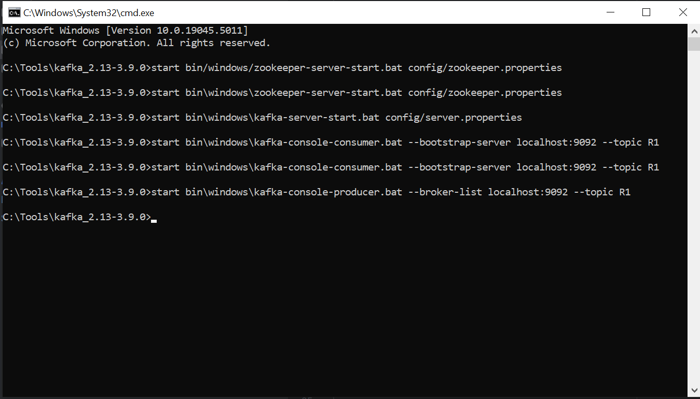
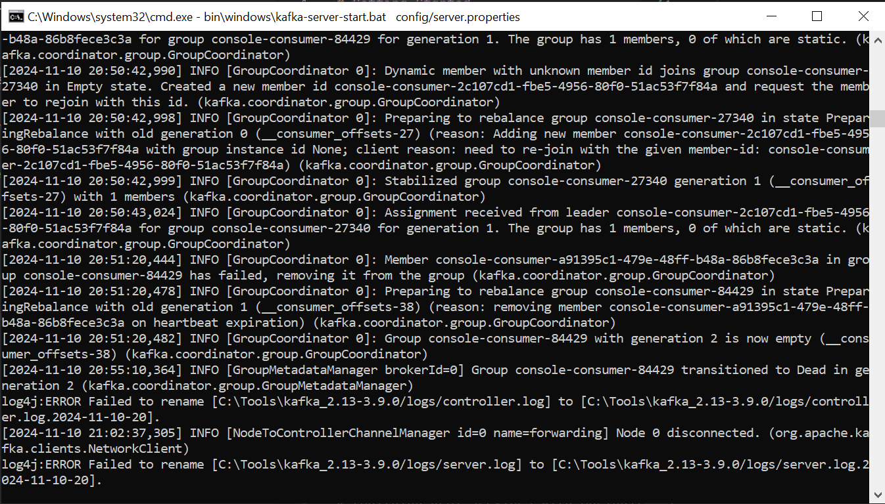
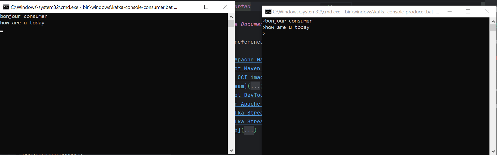
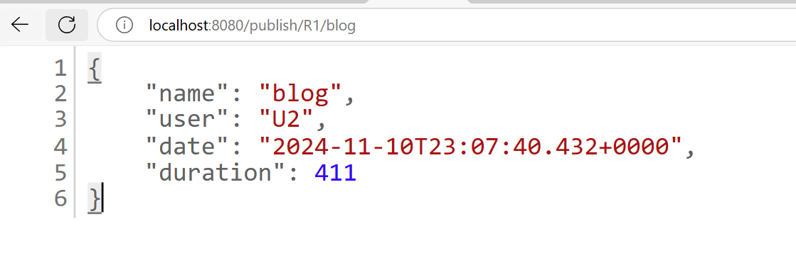
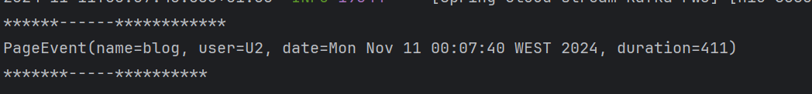
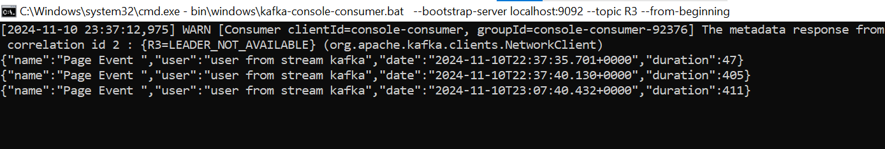
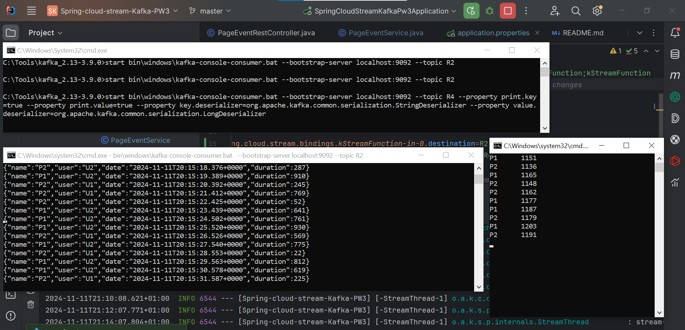
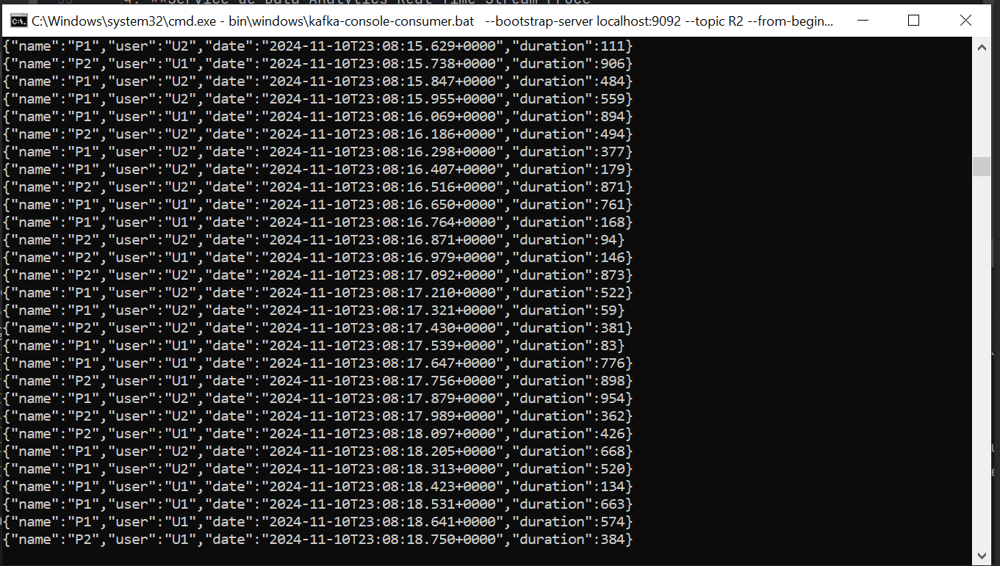
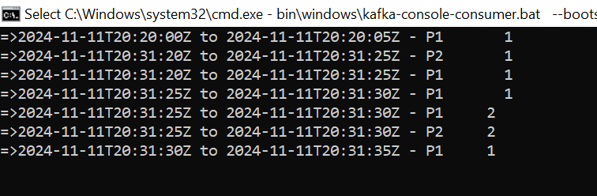
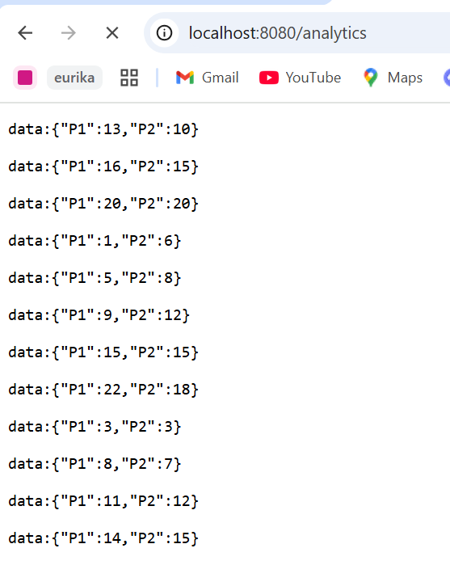

# Kafka Spring Cloud Stream Application

This project uses **Apache Kafka** with **Spring Cloud Stream** to demonstrate the creation of a message production and consumption system, as well as a real-time analytics service.


## Starting Kafka and Zookeeper

Using Docker Compose, we define two services: the first is `zookeeper`, responsible for managing the cluster, and the second is a single Kafka broker service named `kafka`.

```yaml
services:
  zookeeper:
    image: confluentinc/cp-zookeeper:latest
    container_name: zookeeper
    environment:
      ZOOKEEPER_CLIENT_PORT: 2181
      ZOOKEEPER_TICK_TIME: 2000
    ports:
      - "2181:2181"

  kafka:
    image: confluentinc/cp-kafka:latest
    container_name: kafka
    depends_on:
      - zookeeper
    environment:
      KAFKA_BROKER_ID: 1
      KAFKA_ZOOKEEPER_CONNECT: zookeeper:2181
      KAFKA_ADVERTISED_LISTENERS: PLAINTEXT://kafka:9092
      KAFKA_OFFSETS_TOPIC_REPLICATION_FACTOR: 1
    ports:
      - "9092:9092"
```
To start the docker containers using the following command :

```bash
docker compose up
```
Test with `kafka-console-producer` and `kafka-console-consumer` :

- **Open terminal to consume messages with `kafka-console-consumer`** :
```bash
docker compose exec kafka bash

kafka-console-consumer --bootstrap-server localhost:9092 --topic R1 --from-beginning
```

- **Open new terminal to produce messages with `kafka-console-producer`** :
```bash
docker compose exec kafka bash

kafka-console-producer.bat --broker-list localhost:9092 --topic R1
```

## Demo

The following screenshots illustrate the demonstration process.







## Application functionnalities

### Kafka producer service using Rest Controller

A Kafka producer using a REST controller to send messages to a Kafka topic.



### Service Consumer KAFKA
A Kafka consumer that receives and displays messages sent to a Kafka topic.






### Service Supplier KAFKA
A Kafka producer that periodically generates messages and sends them to a Kafka topic.



### Service de Data Analytics Real Time Stream Processing
A real-time analytics service using Kafka Streams to continuously process data from one topic and send it to another topic.



### Real time web application
A web application displaying the results of real-time data analysis.




